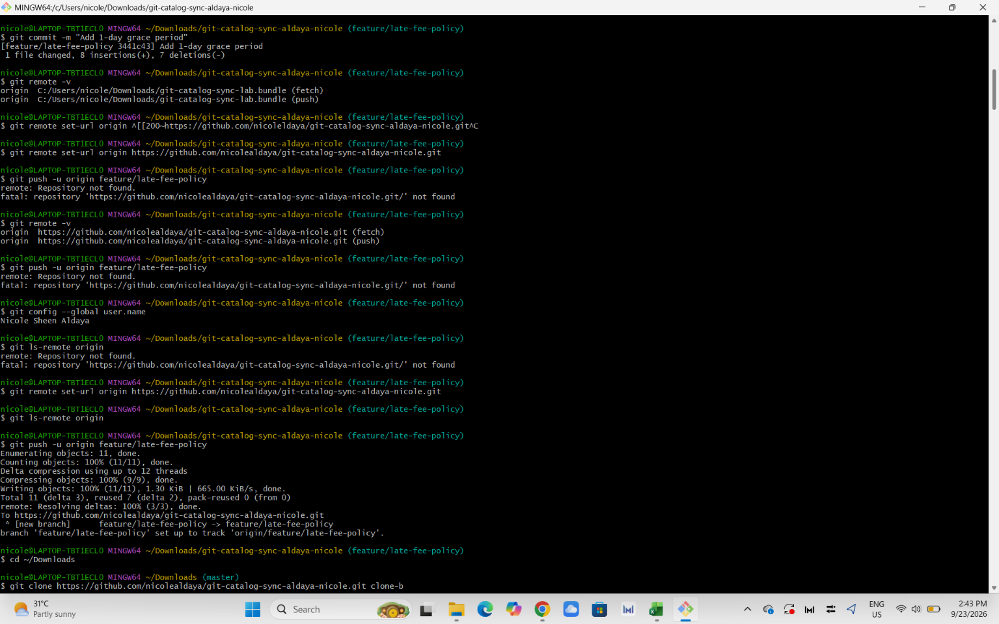
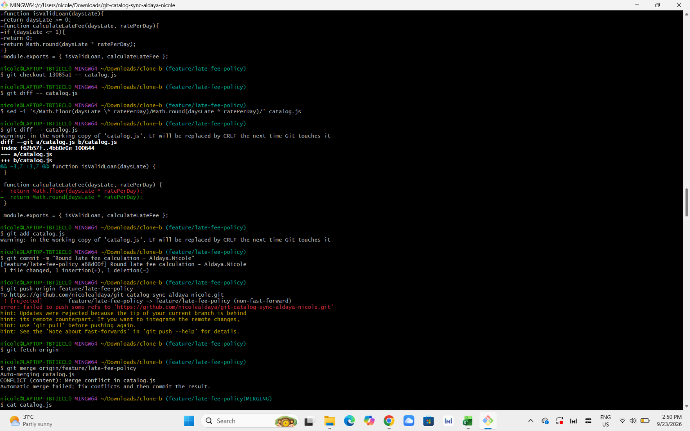
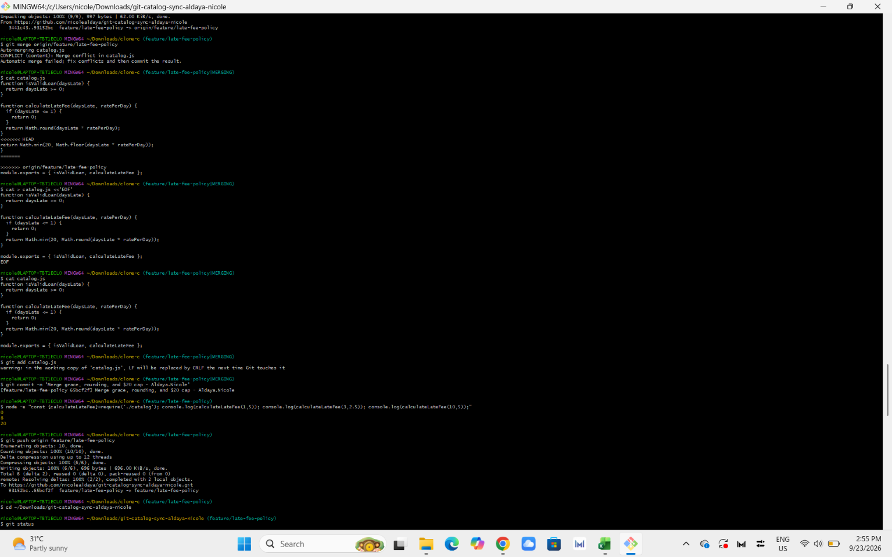
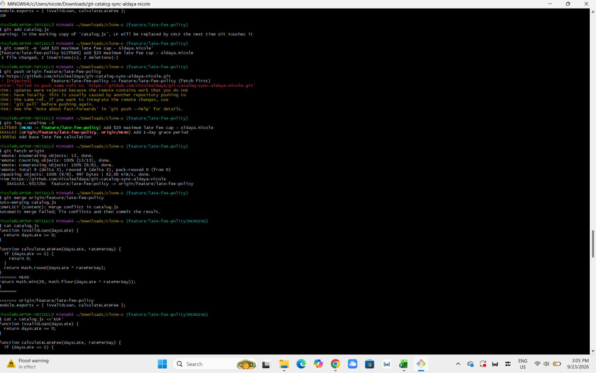
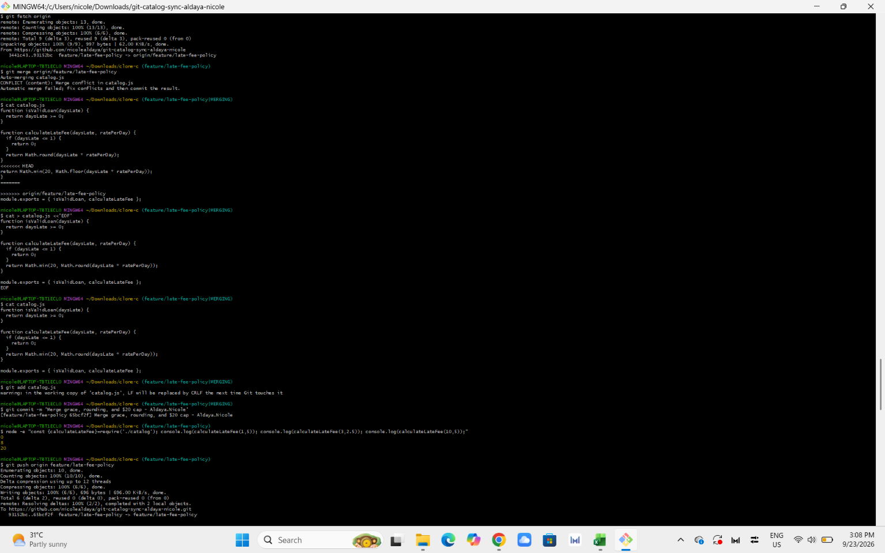
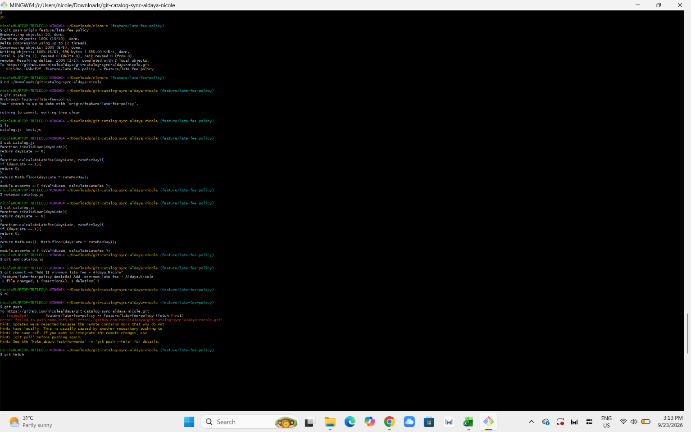
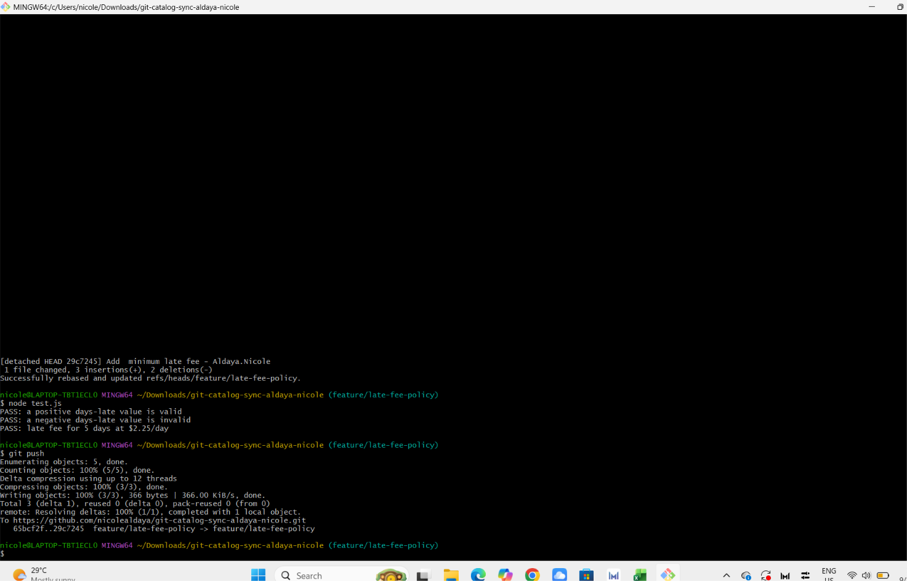
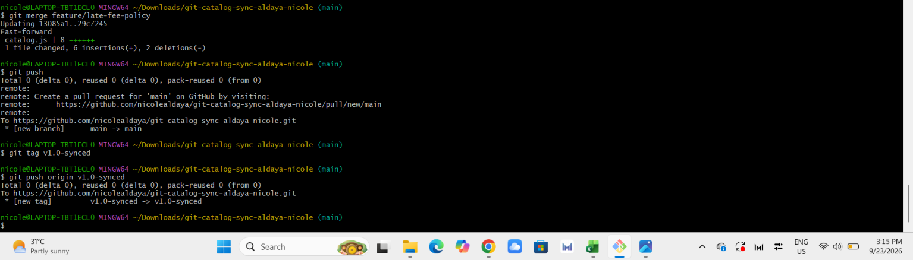

# Workflow

## 1. Final calculateLateFee implementation

The final `calculateLateFee` function combines all four required changes:

```js
function calculateLateFee(daysLate, ratePerDay) {
  if (daysLate <= 1) {
    return 0;
  }

  return Math.min(20, Math.max(1, Math.round(daysLate * ratePerDay)));
}
```

The 1-day grace period was added first, so loans that are 1 day late or less have no fee. The calculated fee is then rounded to the nearest whole number. The $1 minimum makes sure a late loan has at least a $1 fee, while the $20 maximum prevents the fee from going above $20.

## 2. Why was the Task 5 conflict harder than the Task 3 conflict?

Task 3 involved two changes: the 1-day grace period and the rounding of the late fee. The conflict had to be resolved while keeping both changes.

Task 5 involved another change, the $20 maximum late fee cap, while the branch already contained the earlier grace period and rounding changes. Because there were three different changes that needed to work together, the conflict required more care to make sure none of the previous behavior was removed.

## 3. What is the difference between merging and rebasing?

In Task 5, I used `git fetch` and `git merge` to combine the remote changes with the local changes. This created a merge commit that preserved the different branch histories.

In Task 6, I used `git fetch` and `git rebase`. The local minimum-fee commit was replayed on top of the updated remote branch. This produced a more linear history and required resolving the conflict during the rebase.

## 4. What process change would reduce rejected pushes?

A useful process change is to sync with the remote branch before starting new work and before pushing. Contributors can fetch the latest changes and rebase or merge their work before pushing. This helps prevent working on an outdated branch and reduces rejected pushes.

## Screenshots

### Task 1


### Task 2


### Task 3


### Task 4


### Task 5


### Task 6




### Task 7

